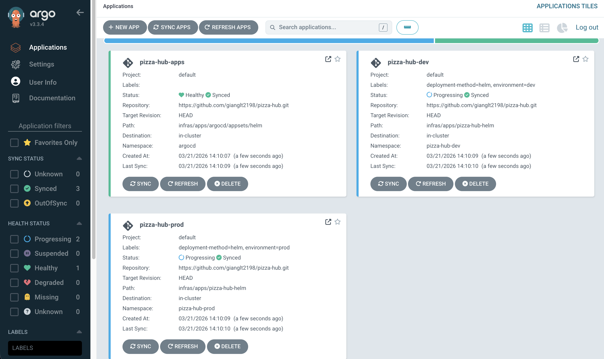
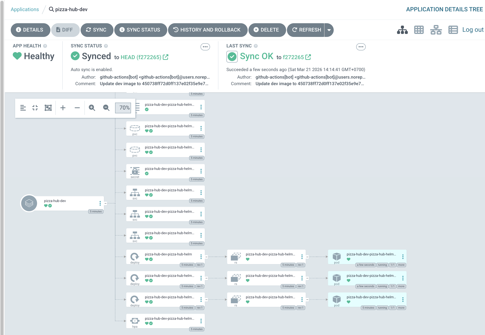

<div align="center">

# 🚀 Production-Ready CI/CD Pipeline

[](https://golang.org/)
[](https://www.terraform.io/)
[](https://kubernetes.io/)
[](https://www.docker.com/)
[](https://argo-cd.readthedocs.io/)
[](https://github.com/features/actions)
[](LICENSE)

**A fully automated, production-grade CI/CD pipeline built to deploy a Go application on Kubernetes — covering everything from infrastructure provisioning to GitOps-driven continuous delivery.**

[📖 Documentation](#-table-of-contents) • [🛠️ Local Setup](#-getting-started) • [🏗️ Architecture](#-architecture-overview) • [📬 Contact](#-contact)

</div>

---

## 📖 Table of Contents

- [🚀 Production-Ready CI/CD Pipeline](#-production-ready-cicd-pipeline)
  - [📖 Table of Contents](#-table-of-contents)
  - [🧩 About the Project](#-about-the-project)
  - [🏗️ Architecture Overview](#️-architecture-overview)
  - [✨ Key Features](#-key-features)
  - [🛠️ Tech Stack](#️-tech-stack)
  - [📁 Project Structure](#-project-structure)
  - [🔄 CI/CD Pipeline Flow](#-cicd-pipeline-flow)
    - [Continuous Integration (GitHub Actions)](#continuous-integration-github-actions)
    - [Continuous Delivery (ArgoCD)](#continuous-delivery-argocd)
  - [🚀 Getting Started](#-getting-started)
    - [Prerequisites](#prerequisites)
    - [1. Provision Infrastructure with Terraform](#1-provision-infrastructure-with-terraform)
    - [2. Install ArgoCD](#2-install-argocd)
    - [3. Deploy Application with Helm \& Kustomize](#3-deploy-application-with-helm--kustomize)
    - [4. Run Locally with Docker](#4-run-locally-with-docker)
    - [5. Run Go App Locally (without Docker)](#5-run-go-app-locally-without-docker)
  - [⚙️ Environment Configuration](#️-environment-configuration)
  - [📊 Monitoring \& Observability](#-monitoring--observability)
  - [🤝 Contributing](#-contributing)
  - [📬 Contact](#-contact)
  - [📄 License](#-license)

---

## 🧩 About the Project

This project demonstrates a **production-ready DevOps portfolio** — a real-world CI/CD pipeline designed to eliminate manual deployment toil, enforce GitOps principles, and support multi-environment software delivery at scale.

> 💡 This is not just a template. Every component is wired together end-to-end, from infrastructure provisioning with Terraform to automated deployments via ArgoCD on Kubernetes.

**Why this project exists:**

- Showcase end-to-end DevOps engineering skills for freelance and contract opportunities
- Provide a reference architecture for teams adopting GitOps
- Serve as an open-source foundation for production Kubernetes pipelines

---

## 🏗️ Architecture Overview

```
┌─────────────────────────────────────────────────────────────────────┐
│                         Developer Workflow                          │
│                                                                     │
│   git push ──► GitHub Repository ──► GitHub Actions (CI)           │
│                                             │                       │
│                          ┌──────────────────┘                       │
│                          ▼                                          │
│              ┌───────────────────────┐                              │
│              │    GitHub Actions     │                              │
│              │  ┌─────────────────┐  │                              │
│              │  │  Lint & Test    │  │                              │
│              │  │  (Go + Docker)  │  │                              │
│              │  └────────┬────────┘  │                              │
│              │           ▼           │                              │
│              │  ┌─────────────────┐  │                              │
│              │  │  Build & Push   │  │                              │
│              │  │  Docker Image   │  │                              │
│              │  │  (GHCR / ECR)   │  │                              │
│              │  └────────┬────────┘  │                              │
│              │           ▼           │                              │
│              │  ┌─────────────────┐  │                              │
│              │  │  Update Image   │  │                              │
│              │  │  Tag in GitOps  │  │                              │
│              │  │  Repo           │  │                              │
│              │  └─────────────────┘  │                              │
│              └───────────┬───────────┘                              │
│                          │                                          │
│              ┌───────────▼───────────┐                              │
│              │        ArgoCD         │                              │
│              │  (GitOps Controller)  │◄── Watches GitOps Repo       │
│              └───────────┬───────────┘                              │
│                          │                                          │
│         ┌────────────────┼───────────────────┐                      │
│         ▼                ▼                   ▼                      │
│  ┌─────────────┐  ┌─────────────┐  ┌─────────────┐                 │
│  │    dev      │  │   staging   │  │    prod     │                 │
│  │ namespace   │  │  namespace  │  │  namespace  │                 │
│  │ (Kustomize) │  │ (Kustomize) │  │ (Kustomize) │                 │
│  └─────────────┘  └─────────────┘  └─────────────┘                 │
│                                                                     │
│              ☁️  Infrastructure provisioned by Terraform             │
│                 (VPC · EKS/GKE · IAM · ECR · Load Balancer)         │
└─────────────────────────────────────────────────────────────────────┘
```

> 📸 **Screenshot**: A screenshot of your ArgoCD dashboard here showing synced applications across environments.
> 

---

## ✨ Key Features

| Feature                          | Description                                                                                                           |
| -------------------------------- | --------------------------------------------------------------------------------------------------------------------- |
| 🔁 **Automated CI Pipeline**     | On every `git push`, GitHub Actions runs linting, unit tests, builds a Docker image, and pushes to container registry |
| 🐳 **Multi-Stage Docker Build**  | Optimized Go image using multi-stage Dockerfile — final image is minimal (`scratch` or `distroless`)                  |
| 🌍 **Infrastructure as Code**    | Full cloud infrastructure (VPC, Kubernetes cluster, IAM, registry) provisioned via Terraform with remote state        |
| ☸️ **Kubernetes Deployment**     | Production-grade K8s manifests with resource limits, health checks, HPA, and PodDisruptionBudgets                     |
| 📦 **Helm Packaging**            | Application packaged as a reusable Helm chart with configurable values per environment                                |
| 🎛️ **Kustomize Overlays**        | Environment-specific configuration (dev / staging / prod) using Kustomize overlays on top of base Helm chart          |
| 🔄 **GitOps with ArgoCD**        | ArgoCD continuously watches the GitOps repo and automatically syncs desired state to the cluster                      |
| 🔀 **Multi-Environment Support** | Fully isolated namespaces and configs for `dev`, `staging`, and `production` environments                             |
| 🔐 **Secret Management**         | Secrets managed via Kubernetes Secrets + Sealed Secrets (or External Secrets Operator)                                |
| 📊 **Observability Ready**       | Prometheus + Grafana stack integration-ready with pre-configured scrape endpoints                                     |

---

## 🛠️ Tech Stack

| Layer                 | Technology     | Purpose                                        |
| --------------------- | -------------- | ---------------------------------------------- |
| **Application**       | Go 1.22+       | Lightweight, high-performance backend service  |
| **Containerization**  | Docker         | Multi-stage build for minimal production image |
| **CI Pipeline**       | GitHub Actions | Automated lint, test, build, and image push    |
| **Infrastructure**    | Terraform      | Cloud infra provisioning (IaC)                 |
| **Orchestration**     | Kubernetes     | Container orchestration and scaling            |
| **Package Manager**   | Helm           | Kubernetes application packaging               |
| **Config Management** | Kustomize      | Environment-specific overlay management        |
| **GitOps**            | ArgoCD         | Continuous delivery and GitOps controller      |

---

## 📁 Project Structure

```
.
├── .github/
│   └── workflows/
│       ├── ci.yml              # CI: lint, test, build, push Docker image
│       └── cd.yml              # CD: update image tag in GitOps repo
│
├── app/                        # Go application source
│   ├── cmd/
│   │   └── main.go
│   ├── internal/
│   │   ├── handler/
│   │   └── service/
│   ├── go.mod
│   └── go.sum
│
├── docker/
│   └── Dockerfile              # Multi-stage optimized Dockerfile
│
├── terraform/
│   ├── modules/
│   │   ├── eks/                # EKS / GKE cluster module
│   │   ├── vpc/                # VPC and networking
│   │   ├── iam/                # IAM roles and policies
│   │   └── ecr/                # Container registry
│   ├── environments/
│   │   ├── dev/
│   │   ├── staging/
│   │   └── prod/
│   ├── main.tf
│   ├── variables.tf
│   └── outputs.tf
│
├── helm/
│   └── app-chart/              # Helm chart for the application
│       ├── Chart.yaml
│       ├── values.yaml         # Default values
│       └── templates/
│           ├── deployment.yaml
│           ├── service.yaml
│           ├── ingress.yaml
│           ├── hpa.yaml
│           └── _helpers.tpl
│
├── kustomize/
│   ├── base/                   # Base Kustomize config
│   │   └── kustomization.yaml
│   └── overlays/
│       ├── dev/
│       │   └── kustomization.yaml
│       ├── staging/
│       │   └── kustomization.yaml
│       └── prod/
│           └── kustomization.yaml
│
├── argocd/
│   ├── apps/
│   │   ├── dev-app.yaml        # ArgoCD Application manifest (dev)
│   │   ├── staging-app.yaml    # ArgoCD Application manifest (staging)
│   │   └── prod-app.yaml       # ArgoCD Application manifest (prod)
│   └── appset/
│       └── applicationset.yaml # ArgoCD ApplicationSet for all envs
│
├── scripts/
│   ├── bootstrap.sh            # One-time cluster setup script
│   └── teardown.sh             # Destroy all resources
│
└── README.md
```

---

## 🔄 CI/CD Pipeline Flow

### Continuous Integration (GitHub Actions)

```
Push to branch
      │
      ▼
┌─────────────┐     ┌─────────────┐     ┌──────────────────┐
│  Go Lint    │────►│  Unit Tests │────►│  Docker Build    │
│  golangci   │     │  go test    │     │  Multi-stage     │
└─────────────┘     └─────────────┘     └────────┬─────────┘
                                                 │
                                                 ▼
                                        ┌──────────────────┐
                                        │  Push to Registry│
                                        │  (GHCR / ECR)    │
                                        │  tag: sha-xxxxxx │
                                        └────────┬─────────┘
                                                 │
                                                 ▼
                                        ┌──────────────────┐
                                        │  Update GitOps   │
                                        │  Repo image tag  │
                                        └──────────────────┘
```

### Continuous Delivery (ArgoCD)

```
GitOps Repo updated
         │
         ▼
┌─────────────────┐     ┌─────────────────┐     ┌─────────────────┐
│  ArgoCD detects │────►│  Diff & Sync    │────►│  Deploy to K8s  │
│  drift          │     │  (auto/manual)  │     │  (Rolling       │
└─────────────────┘     └─────────────────┘     │   Update)       │
                                                └─────────────────┘
```

---

## 🚀 Getting Started

### Prerequisites

Make sure you have the following installed:

| Tool       | Version | Install                                                                              |
| ---------- | ------- | ------------------------------------------------------------------------------------ |
| Go         | >= 1.25 | [golang.org](https://golang.org/dl/)                                                 |
| Docker     | >= 28.0 | [docs.docker.com](https://docs.docker.com/get-docker/)                               |
| Terraform  | >= 1.6  | [developer.hashicorp.com](https://developer.hashicorp.com/terraform/install)         |
| kubectl    | >= 1.35 | [kubernetes.io](https://kubernetes.io/docs/tasks/tools/)                             |
| Helm       | >= 4.0  | [helm.sh](https://helm.sh/docs/intro/install/)                                       |
| ArgoCD CLI | >= 2.10 | [argo-cd.readthedocs.io](https://argo-cd.readthedocs.io/en/stable/cli_installation/) |
| kustomize  | >= 5.0  | [kustomize.io](https://kubectl.docs.kubernetes.io/installation/kustomize/)           |

---

### 1. Provision Infrastructure with Terraform

```bash
# Clone the repository
git clone https://github.com/<your-username>/<repo-name>.git
cd <repo-name>

# Initialize Terraform
cd terraform/environments/dev
terraform init

# Review the plan
terraform plan

# Apply infrastructure
terraform apply
```

> ⚠️ Set your cloud credentials (`AWS_ACCESS_KEY_ID`, `AWS_SECRET_ACCESS_KEY`, or equivalent) as environment variables before running Terraform.

---

### 2. Install ArgoCD

```bash
# Create ArgoCD namespace
kubectl create namespace argocd

# Install ArgoCD
kubectl apply -n argocd -f https://raw.githubusercontent.com/argoproj/argo-cd/stable/manifests/install.yaml

# Wait for ArgoCD to be ready
kubectl wait --for=condition=available --timeout=300s deployment/argocd-server -n argocd

# Access ArgoCD UI (port-forward)
kubectl port-forward svc/argocd-server -n argocd 8080:443

# Get initial admin password
argocd admin initial-password -n argocd

# Apply ArgoCD application manifests
kubectl apply -f argocd/apps/
```

> 📸 **Screenshot**: A screenshot of your ArgoCD UI with apps in sync here.


### 3. Deploy Application with Helm & Kustomize

```bash
# Deploy to dev using Kustomize
kubectl apply -k kustomize/overlays/dev

# Or deploy using Helm directly
helm upgrade --install my-app helm/app-chart/ \
  --namespace dev \
  --create-namespace \
  --values helm/app-chart/values.yaml

# Verify deployment
kubectl get pods -n dev
kubectl get svc -n dev
```

---

### 4. Run Locally with Docker

```bash
# Build the Docker image
docker build -t my-app:local -f docker/Dockerfile .

# Run the container
docker run -p 8080:8080 my-app:local

# Verify it's running
curl http://localhost:8080/health
```

---

### 5. Run Go App Locally (without Docker)

```bash
cd app/

# Install dependencies
go mod download

# Run the application
go run cmd/main.go

# Run tests
go test ./...

# Run with coverage
go test -cover ./...
```

---

## ⚙️ Environment Configuration

Environments are managed using **Kustomize overlays** on top of a base Helm chart.

| Environment | Namespace | Replicas | Auto-Sync          |
| ----------- | --------- | -------- | ------------------ |
| `dev`       | `dev`     | 1        | ✅ Enabled         |
| `staging`   | `staging` | 2        | ✅ Enabled         |
| `prod`      | `prod`    | 3+ (HPA) | 🔒 Manual approval |

Customize per-environment values in `kustomize/overlays/<env>/kustomization.yaml`:

```yaml
# kustomize/overlays/prod/kustomization.yaml
apiVersion: kustomize.config.k8s.io/v1beta1
kind: Kustomization

bases:
  - ../../base

patches:
  - path: replicas-patch.yaml
  - path: resources-patch.yaml

images:
  - name: my-app
    newTag: "sha-abc1234"
```

---

## 📊 Monitoring & Observability

This pipeline is observability-ready. To enable monitoring:

```bash
# Install Prometheus + Grafana stack
helm repo add prometheus-community https://prometheus-community.github.io/helm-charts
helm install kube-prometheus-stack prometheus-community/kube-prometheus-stack \
  --namespace monitoring \
  --create-namespace

# Access Grafana
kubectl port-forward svc/kube-prometheus-stack-grafana 3000:80 -n monitoring
```

- **Prometheus**: Metrics scraping at `/metrics`
- **Grafana**: Pre-built dashboards for Go app + Kubernetes cluster health
- **Alertmanager**: Alert routing for critical pod failures and pipeline errors

---

## 🤝 Contributing

Contributions, issues, and feature requests are welcome!

1. Fork the project
2. Create your feature branch (`git checkout -b feature/amazing-feature`)
3. Commit your changes (`git commit -m 'feat: add amazing feature'`)
4. Push to the branch (`git push origin feature/amazing-feature`)
5. Open a Pull Request

Please follow [Conventional Commits](https://www.conventionalcommits.org/) for commit messages.

---

## 📬 Contact

> 💼 Open to **BE Freelancer and contract DevOps engagements** — platform engineering, CI/CD design, Kubernetes migrations, and cloud infrastructure.

- **GitHub**: [@gianglt2198](https://github.com/gianglt2198)
- **LinkedIn**: [linkedin.com/in/giang-le-bb7b391a1/](https://linkedin.com/in/giang-le-bb7b391a1/)
- **Email**: gianglt2198@gmail.com

---

## 📄 License

This project is licensed under the **MIT License** — see the [LICENSE](LICENSE) file for details.

---

<div align="center">

⭐ If this project helped you, please consider giving it a star!

**Built with ❤️ by [Your Name] — DevOps Engineer**

</div>
