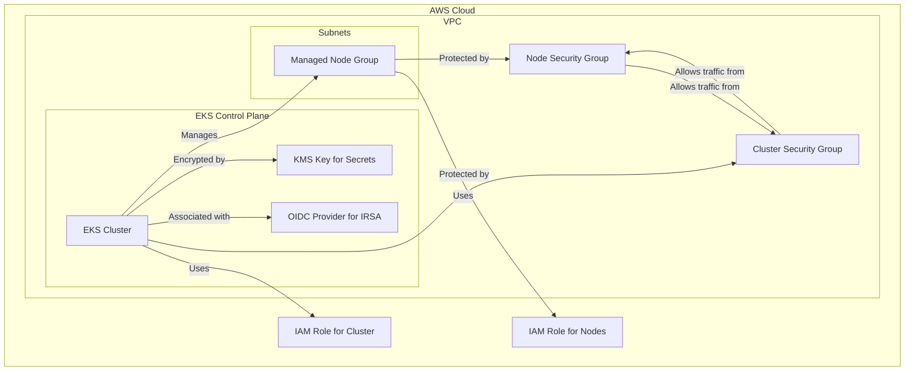

# EKS Terraform Module

This Terraform module creates a robust and scalable Amazon EKS (Elastic Kubernetes Service) cluster on AWS. It is designed to provide a secure, managed, and production-ready Kubernetes environment.

## High-Level Architecture

The module provisions the following key components:

- **EKS Cluster**: The managed Kubernetes control plane.
- **Managed Node Groups**: Groups of EC2 instances that serve as worker nodes for the cluster.
- **IAM Roles**:
  - **Cluster Role**: Grants permissions to the EKS control plane to manage AWS resources.
  - **Node Role**: Grants permissions to the worker nodes to connect to the cluster and access other AWS services.
- **Security Groups**:
  - **Cluster Security Group**: Controls traffic to the EKS control plane.
  - **Node Security Group**: Controls traffic to and from the worker nodes.
- **KMS Key**: Encrypts Kubernetes secrets at rest for enhanced security.
- **OIDC Provider**: Enables IAM Roles for Service Accounts (IRSA) to provide fine-grained permissions to pods.
- **EKS Add-ons**: Manages essential Kubernetes add-ons like `vpc-cni`, `coredns`, and `kube-proxy`.

## Variables

The module is configurable through the following variables:

| Variable                          | Description                                               | Type           | Default              |
| --------------------------------- | --------------------------------------------------------- | -------------- | -------------------- |
| `cluster_name`                    | Name of the EKS cluster.                                  | `string`       | -                    |
| `cluster_version`                 | The Kubernetes version for the cluster.                   | `string`       | `"1.35"`             |
| `cluster_endpoint_private_access` | Enables private access to the EKS API server endpoint.    | `bool`         | `true`               |
| `cluster_endpoint_public_access`  | Enables public access to the EKS API server endpoint.     | `bool`         | `true`               |
| `vpc_id`                          | The ID of the VPC where the cluster will be deployed.     | `string`       | -                    |
| `subnet_ids`                      | A list of subnet IDs for the EKS cluster and node groups. | `list(string)` | -                    |
| `enable_irsa`                     | Enables IAM Roles for Service Accounts (IRSA).            | `bool`         | `true`               |
| `node_groups`                     | A map of configurations for the managed node groups.      | `map(object)`  | -                    |
| `public_access_cidrs`             | CIDR blocks that can access the public EKS API endpoint.  | `list(string)` | `["0.0.0.0/0"]`      |
| `tags`                            | A map of tags to apply to all created resources.          | `map(string)`  | `{}`                 |
| `add_ons`                         | A map of EKS add-on configurations to install.            | `map(any)`     | (see `variables.tf`) |

## Outputs

The module exports the following outputs:

| Output                      | Description                                                    |
| --------------------------- | -------------------------------------------------------------- |
| `cluster_id`                | The ID of the EKS cluster.                                     |
| `cluster_arn`               | The ARN of the EKS cluster.                                    |
| `cluster_name`              | The name of the EKS cluster.                                   |
| `cluster_endpoint`          | The endpoint for the EKS API server.                           |
| `cluster_version`           | The Kubernetes version of the EKS cluster.                     |
| `cluster_ca_certificate`    | The base64 encoded certificate authority data for the cluster. |
| `cluster_oidc_issuer_url`   | The OIDC issuer URL for the cluster, used for IRSA.            |
| `oidc_provider_arn`         | The ARN of the OIDC provider.                                  |
| `node_groups`               | Details about the created node groups.                         |
| `cluster_security_group_id` | The ID of the security group for the EKS control plane.        |
| `node_security_group_id`    | The ID of the security group for the worker nodes.             |
