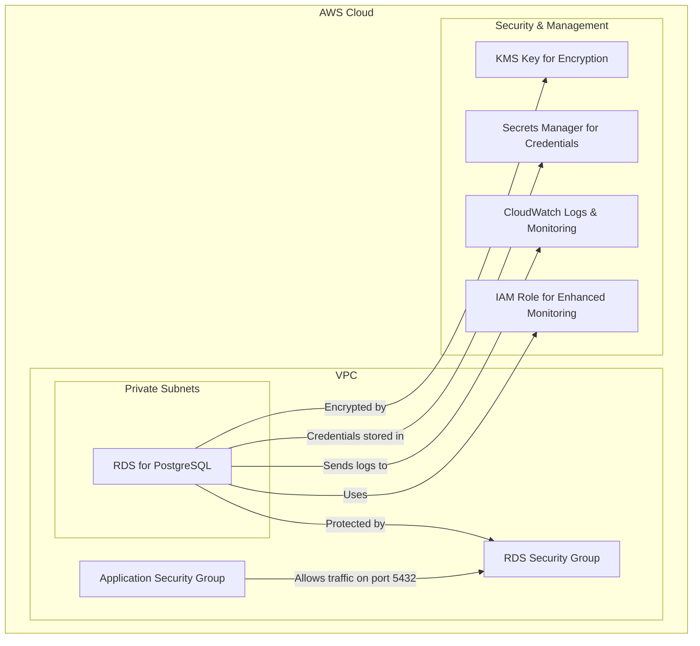

# RDS Terraform Module

This Terraform module creates a secure and scalable Amazon RDS for PostgreSQL instance. It is designed for production workloads, incorporating best practices for security, high availability, and manageability.

## High-Level Architecture

The module provisions the following key components:

- **RDS for PostgreSQL**: A managed relational database instance.
- **DB Subnet Group**: Associates the RDS instance with private subnets for network isolation.
- **Security Group**: Controls inbound traffic to the database, allowing access only from specified security groups or CIDR blocks.
- **KMS Key**: Encrypts the database storage and automated backups at rest.
- **Secrets Manager**: Securely stores and manages the master database credentials, automatically generating a random password.
- **Parameter and Option Groups**: Provides fine-grained control over database settings and extensions.
- **CloudWatch Logs**: Captures and stores PostgreSQL logs for monitoring and auditing.
- **IAM Role**: Grants permissions for Enhanced Monitoring if enabled.
- **Read Replica (Optional)**: A read-only copy of the database to scale read traffic.

## Variables

The module is highly configurable through the following variables:

| Variable                     | Description                                                | Type           | Default         |
| ---------------------------- | ---------------------------------------------------------- | -------------- | --------------- |
| `identifier`                 | A unique identifier for the RDS instance.                  | `string`       | -               |
| `engine_version`             | The PostgreSQL engine version.                             | `string`       | `"15.4"`        |
| `instance_class`             | The instance class for the RDS instance.                   | `string`       | `"db.t3.micro"` |
| `allocated_storage`          | The initial allocated storage in GB.                       | `number`       | `20`            |
| `max_allocated_storage`      | The maximum storage to allow for autoscaling.              | `number`       | `100`           |
| `storage_type`               | The storage type for the RDS instance.                     | `string`       | `"gp3"`         |
| `database_name`              | The name of the database to create.                        | `string`       | `"pizzahub"`    |
| `username`                   | The master username for the database.                      | `string`       | `"pizza"`       |
| `vpc_id`                     | The ID of the VPC where the RDS instance will be deployed. | `string`       | -               |
| `subnet_ids`                 | A list of private subnet IDs for the DB subnet group.      | `list(string)` | -               |
| `allowed_security_group_ids` | A list of security group IDs allowed to access the DB.     | `list(string)` | `[]`            |
| `allowed_cidr_blocks`        | A list of CIDR blocks allowed to access the DB.            | `list(string)` | `[]`            |
| `backup_retention_period`    | The number of days to retain automated backups.            | `number`       | `7`             |
| `deletion_protection`        | Enables deletion protection for the database.              | `bool`         | `true`          |
| `create_read_replica`        | If true, a read replica will be created.                   | `bool`         | `false`         |
| `tags`                       | A map of tags to apply to all created resources.           | `map(string)`  | `{}`            |

## Outputs

The module exports the following outputs:

| Output                       | Description                                                            |
| ---------------------------- | ---------------------------------------------------------------------- |
| `db_instance_id`             | The ID of the RDS instance.                                            |
| `db_instance_arn`            | The ARN of the RDS instance.                                           |
| `db_endpoint`                | The connection endpoint for the database.                              |
| `db_port`                    | The port for the database.                                             |
| `db_name`                    | The name of the database.                                              |
| `db_username`                | The master username for the database.                                  |
| `db_password`                | The master password for the database (retrieved from Secrets Manager). |
| `secret_manager_secret_arn`  | The ARN of the Secrets Manager secret containing the DB credentials.   |
| `secret_manager_secret_name` | The name of the Secrets Manager secret.                                |
| `db_connection_string`       | The full connection string for the database.                           |
| `security_group_id`          | The ID of the security group attached to the RDS instance.             |
| `kms_key_id`                 | The ID of the KMS key used for encryption.                             |
| `read_replica_endpoint`      | The endpoint of the read replica, if created.                          |
| `cloudwatch_log_group_name`  | The name of the CloudWatch log group for PostgreSQL logs.              |
