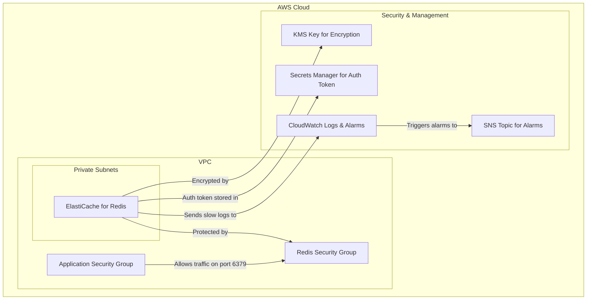

# Redis Terraform Module

This Terraform module creates a secure, scalable, and production-ready Amazon ElastiCache for Redis cluster. It is designed to provide a high-performance caching layer for your applications.

## High-Level Architecture

The module provisions the following key components:

- **ElastiCache for Redis**: A managed in-memory data store, configured as a replication group for high availability.
- **Subnet Group**: Associates the ElastiCache cluster with private subnets for network isolation.
- **Security Group**: Controls inbound traffic to the Redis cluster, allowing access only from specified security groups or CIDR blocks.
- **KMS Key**: Encrypts the data at rest and in transit (if enabled).
- **Secrets Manager (Optional)**: Securely stores and manages the Redis authentication token if `auth_token_enabled` is set to `true`.
- **Parameter Group**: Allows for fine-tuning of Redis configuration parameters.
- **CloudWatch Logs**: Captures and stores Redis slow logs for performance analysis.
- **CloudWatch Alarms (Optional)**: Monitors key metrics like CPU utilization, memory usage, and connection count, sending notifications to an SNS topic if thresholds are breached.

## Variables

The module is highly configurable through the following variables:

| Variable                     | Description                                                    | Type           | Default            |
| ---------------------------- | -------------------------------------------------------------- | -------------- | ------------------ |
| `project`                    | A unique identifier for the ElastiCache cluster.               | `string`       | -                  |
| `engine_version`             | The Redis engine version.                                      | `string`       | `"7.0"`            |
| `node_type`                  | The node type for the ElastiCache instances.                   | `string`       | `"cache.t3.micro"` |
| `num_cache_clusters`         | The number of cache nodes in the replication group.            | `number`       | `1`                |
| `vpc_id`                     | The ID of the VPC where the cluster will be deployed.          | `string`       | -                  |
| `subnet_ids`                 | A list of private subnet IDs for the ElastiCache subnet group. | `list(string)` | -                  |
| `allowed_security_group_ids` | A list of security group IDs allowed to access Redis.          | `list(string)` | `[]`               |
| `at_rest_encryption_enabled` | Enables encryption at rest.                                    | `bool`         | `false`            |
| `transit_encryption_enabled` | Enables encryption in transit.                                 | `bool`         | `false`            |
| `auth_token_enabled`         | Enables Redis authentication.                                  | `bool`         | `false`            |
| `automatic_failover_enabled` | Enables automatic failover for high availability.              | `bool`         | `true`             |
| `multi_az_enabled`           | Enables Multi-AZ deployment.                                   | `bool`         | `false`            |
| `snapshot_retention_limit`   | The number of days to retain automated snapshots.              | `number`       | `3`                |
| `enable_cloudwatch_alarms`   | Enables CloudWatch alarms for key metrics.                     | `bool`         | `false`            |
| `alarm_actions`              | A list of SNS topic ARNs to notify when an alarm is triggered. | `list(string)` | `[]`               |
| `tags`                       | A map of tags to apply to all created resources.               | `map(string)`  | `{}`               |

## Outputs

The module exports the following outputs:

| Output                      | Description                                                      |
| --------------------------- | ---------------------------------------------------------------- |
| `replication_group_id`      | The ID of the ElastiCache replication group.                     |
| `primary_endpoint_address`  | The connection endpoint for the primary node.                    |
| `reader_endpoint_address`   | The connection endpoint for the reader nodes.                    |
| `port`                      | The port for the Redis cluster.                                  |
| `auth_token`                | The Redis authentication token (if enabled).                     |
| `secret_manager_secret_arn` | The ARN of the Secrets Manager secret containing the auth token. |
| `connection_string`         | The full connection string for the Redis cluster.                |
| `security_group_id`         | The ID of the security group attached to the Redis cluster.      |
| `kms_key_id`                | The ID of the KMS key used for encryption.                       |
| `cloudwatch_log_group_name` | The name of the CloudWatch log group for Redis slow logs.        |
