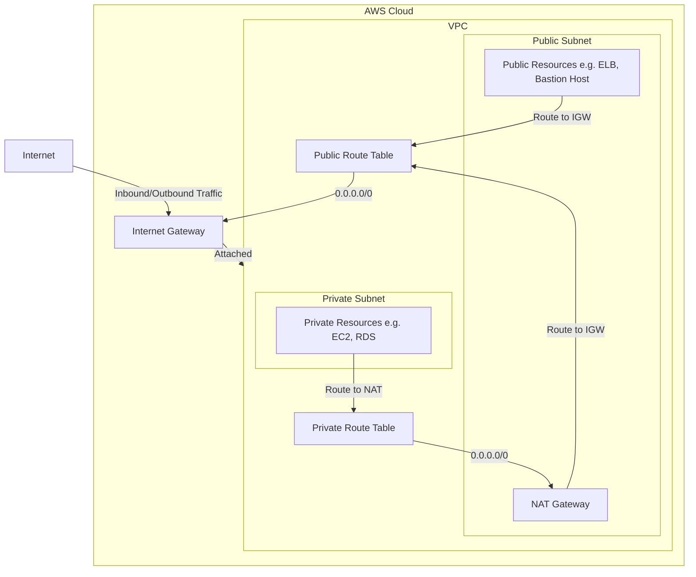

# VPC Terraform Module

This Terraform module creates a robust and scalable Virtual Private Cloud (VPC) on AWS, designed to provide a secure and isolated network environment for your applications.

## High-Level Architecture

The module provisions the following key components to establish a flexible and secure network infrastructure:

- **VPC**: A logically isolated virtual network to launch your AWS resources.
- **Subnets**:
  - **Public Subnets**: Positioned for resources that need direct internet access, such as web servers or load balancers.
  - **Private Subnets**: Designed for backend services, databases, and applications that should not be directly exposed to the internet.
- **Internet Gateway (IGW)**: Enables communication between resources in your public subnets and the internet.
- **NAT Gateways**: Allows instances in private subnets to initiate outbound traffic to the internet (e.g., for software updates) while remaining inaccessible from external networks.
- **Route Tables**:
  - **Public Route Table**: Directs traffic from public subnets to the Internet Gateway.
  - **Private Route Tables**: Routes traffic from private subnets through the NAT Gateways for outbound internet access.

This architecture ensures a clear separation between public-facing and private resources, enhancing security and network control.

## Variables

The module is configurable through the following variables, allowing you to customize the VPC to your specific requirements:

| Variable \*\*\*\*      | Description                                         | Type           | Default                            |
| ---------------------- | --------------------------------------------------- | -------------- | ---------------------------------- |
| `vpc_cidr`             | The CIDR block for the VPC.                         | `string`       | `"10.0.0.0/16"`                    |
| `project`              | The project name used for resource tagging.         | `string`       | `"pizza-hub"`                      |
| `public_subnet_cidrs`  | A list of CIDR blocks for the public subnets.       | `list(string)` | `["10.0.1.0/24", "10.0.2.0/24"]`   |
| `private_subnet_cidrs` | A list of CIDR blocks for the private subnets.      | `list(string)` | `["10.0.10.0/24", "10.0.20.0/24"]` |
| `tags`                 | A map of additional tags to apply to all resources. | `map(string)`  | `{}`                               |

## Outputs

Upon successful execution, the module exports the following outputs, which can be used to integrate the VPC with other infrastructure components:

| Output                      | Description                                                |
| --------------------------- | ---------------------------------------------------------- |
| `vpc_id`                    | The ID of the created VPC.                                 |
| `vpc_cidr_block`            | The CIDR block of the VPC.                                 |
| `vpc_arn`                   | The ARN of the VPC.                                        |
| `internet_gateway_id`       | The ID of the Internet Gateway.                            |
| `public_subnet_ids`         | A list of IDs for the public subnets.                      |
| `private_subnet_ids`        | A list of IDs for the private subnets.                     |
| `public_subnet_cidrs`       | A list of CIDR blocks for the public subnets.              |
| `private_subnet_cidrs`      | A list of CIDR blocks for the private subnets.             |
| `nat_gateway_ids`           | A list of IDs for the NAT Gateways.                        |
| `nat_gateway_public_ips`    | A list of public Elastic IPs assigned to the NAT Gateways. |
| `availability_zones`        | The availability zones used for the subnets.               |
| `public_route_table_ids`    | The IDs of the public route tables.                        |
| `private_route_table_ids`   | The IDs of the private route tables.                       |
| `default_security_group_id` | The ID of the default security group for the VPC.          |
| `vpc_main_route_table_id`   | The ID of the main route table associated with the VPC.    |

This comprehensive set of outputs provides all the necessary information to connect and manage resources within your newly created VPC.
